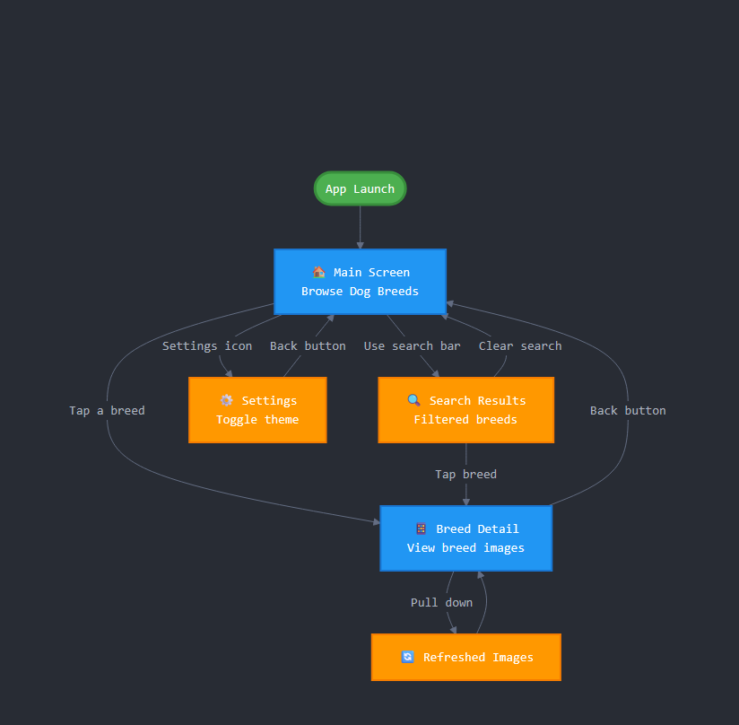

# AND101 Milestone 2 - Dog Breed Gallery

Submitted by:
- Dylan-Dirac Nintunze
- Emmanuel
- Prashant Basyal
- Suritaneil Sahota
- Dang-Quang Nguyen

Time spent: **3.5** hours spent in total

## Summary

This document provides a summary of our project building process for our app, **Dog Breed Gallery**. Our app allows users to search for and view different dog breeds using the Dog CEO API. It includes a user-friendly UI, dynamic image fetching, and a dark/light mode toggle for accessibility.

## Milestone Requirements

The following REQUIRED features are completed:

- [x] Assign features to each member of your group
- [x] Establish a goal time for completing each feature

The following REQUIRED files are included:

- [x] Updated 📄 `project_spec.md`, which contains:
  - [x] App Overview (Milestone 1)
  - [x] App Spec (Milestone 1)
  - [x] Checked off 2+ completed features
  - [x] 2+ Videos/GIFs of build progress

- [x] Our 🎥 Demo Video
  - [x] We have also added the Demo Video Link to the Group Info Form on the course portal.

The following EXTRA features are implemented:

- [x] Interactive GIF showing app functionality

## App Overview (Description and Evaluation)

**App Name:** DogBreed Gallery

**App Description:**
DogBreed Gallery is an Android application designed to help users explore, learn about, and visually browse various dog breeds. Using the Dog CEO API, the app displays a scrollable gallery of dog images categorized by breed. Users can search and filter breeds with ease, making the app both educational and fun for dog lovers.

Initially, our team attempted to build a weather forecasting app using the OpenWeatherMap API. However, due to recurring issues with API keys, data fetching inconsistencies, and parsing problems, we reevaluated our direction. After exploring multiple ideas—including a Pokémon API viewer—we settled on DogBreed Gallery due to its straightforward data structure, reliable public API, and immediate visual engagement.

We evaluated our ideas based on:
- **API reliability and ease of integration**
- **Visual appeal and user engagement**
- **Feasibility within the milestone timeframe**

DogBreed Gallery scored highest in all categories, allowing us to focus on solid UI/UX and functionality.

---

## App Spec (User Features, Screens & Navigation Flows)

### Core Features:
- ✅ Display a list of all dog breeds
- ✅ Tap a breed to see a list of images
- ✅ Search for a breed by name
- ✅ Pull-to-refresh feature for refreshing image list
- ✅ Toggle between light and dark themes

### Planned Stretch Features (Some may still be in development):
- 🔄 Save favorite breeds locally
- 🧠 Provide brief fun facts about each breed
- 📁 Ability to download images

### Screens:
1. **Main Gallery Screen**: List of all breeds using RecyclerView with images
2. **Breed Detail Screen**: Displays a scrollable grid of images related to a selected breed
3. **Search Bar**: At the top of the main screen to filter dog breeds dynamically
4. **Settings/Theme Toggle**: Toggle between dark and light mode

### Navigation Flow:

We used modern Android practices including:
- ViewBinding for UI
- Glide for image loading
- Retrofit for API integration
- Material Design components

## 🎥 Demo Video

Here's a video that demos all of the app's implemented features:

## Notes

### Feature & Task Division by Member:

- **Dylan-Dirac Nintunze**: Created GitHub repo, initial setup, project initialization.
- **Emmanuel**: Led brainstorming, evaluated app ideas, finalized direction.
- **Prashant Basyal**: Integrated Dog CEO API, implemented main RecyclerView and search logic, created demo GIF.
- **Suritaneil Sahota**: Sketched and designed wireframe layout for app screens.
- **Dang-Quang Nguyen**: Wrote App Overview and Spec, created digital Figma mockups, UI polish.

